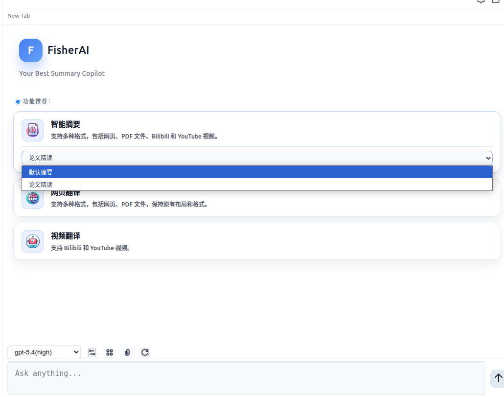
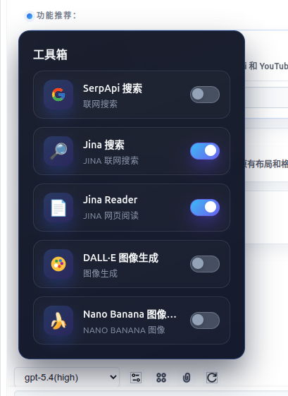
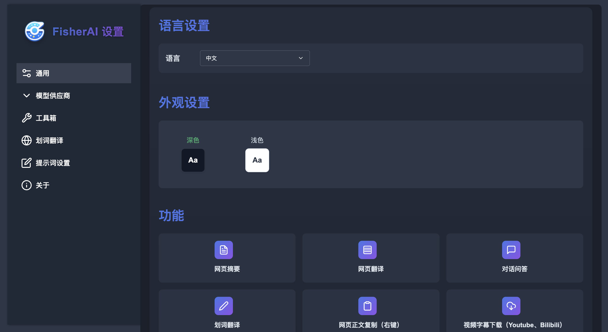
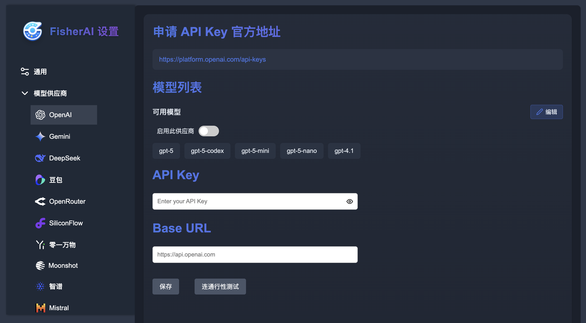
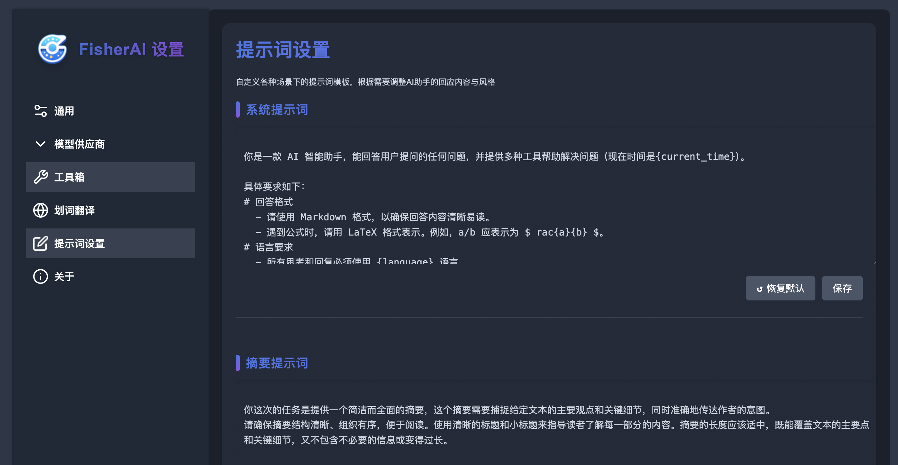

<div align="center">
    <h1>PagePilot AI</h1>
    <p>🚀 面向网页的 AI 摘要、翻译与对话助手</p>
    <p>
        
    </p>
</div>

## 📖 简介

PagePilot AI 是一个基于 [FisherAI](https://github.com/fisherdaddy/FisherAI) 独立修改而来的 Chrome 扩展分支，专注于网页摘要、翻译、问答与多模型协作体验。相较于上游版本，这个仓库重点补强了会话管理、长上下文治理、划词联动和工具调用体验。当前仓库主要用于 GitHub 分发和社区试用，不代表上游官方版本。

本项目保留上游 Apache 2.0 许可证，并在此基础上继续分发和修改。具体来源说明见 [ATTRIBUTION.md](ATTRIBUTION.md)，第三方依赖说明见 [THIRD_PARTY_NOTICES.md](THIRD_PARTY_NOTICES.md)。

### ✨ 主要特性

- 🔍 **智能摘要与提示词切换** - 支持网页、PDF、Bilibili、YouTube 内容摘要，并可快速切换不同摘要模板
- 🌍 **网页与视频翻译** - 支持网页全文翻译、字幕翻译与划词翻译
- 💬 **持续多轮对话** - 不再只是单次问答，支持围绕当前网页内容持续追问、补问和反复对话
- 🗂️ **会话与分组管理** - 支持多会话、新建分组、移动分组、重命名和删除
- 🧠 **上下文管理与会话恢复** - 自动保存历史消息，重新打开会话后可恢复对话状态，并按需构建发送给模型的上下文
- ✂️ **长对话上下文压缩** - 自动压缩旧的助手回复和工具结果，尽量保留关键上下文与最近轮次，降低上下文膨胀
- ✍️ **划词自动同步侧边栏** - 选中文本会自动送入侧边栏，同时保留快捷翻译入口
- ∑ **LaTeX 公式渲染修复** - 改善 Markdown 与公式混排场景下的渲染稳定性，减少公式显示异常
- 🤖 **多模型支持** - 集成主流大语言模型，可自定义 API，也支持本地 Ollama
- 🛠️ **联网工具箱** - 内置 SerpApi、Jina Search、Jina Reader、DALL·E、Nano Banana 等能力

### 🧩 对话与上下文管理

- 当前版本支持真正的连续对话，不是一次摘要后就丢失上下文
- 会话历史会持久化保存，可在不同会话之间切换，并继续之前的追问
- 发送到模型的上下文会根据历史消息动态构建，而不是无差别全量拼接
- 当历史过长时，会优先保留系统提示、近期用户消息、近期助手回复和关键工具结果
- 对较早的回复和工具输出会做压缩处理，尽量在上下文窗口内保留可用信息

### 🗂️ 会话管理

- 支持 `New Session`，可以随时开启一个全新的对话，不污染当前上下文
- 支持 `New Group`，可以按主题、任务或项目整理多个会话
- 支持在侧边栏会话列表中快速切换不同会话，继续之前的聊天
- 支持把会话移动到其他分组，便于长期整理
- 支持会话和分组的重命名，方便按内容归档
- 支持删除不再需要的会话，保持列表干净

## 🖼️ 界面预览

**主界面与摘要模板切换**

<div align="center">
    
</div>
<br/>

**联网工具箱**

<div align="center">
    
</div>
<br/>

**设置页与模型配置**

<div align="center">
    
</div>
<br/>
<div align="center">
    
</div>
<br/>
<div align="center">
    
</div>
<br/>

## 🚀 快速开始

### 安装方式

1. 克隆你自己的仓库或当前仓库：
   - `git clone <your-repo-url>`
2. 打开 Chrome 扩展管理页面：`chrome://extensions/`
3. 开启“开发者模式”
4. 点击“加载已解压的扩展程序”，选择仓库目录

### 来源与署名

- Upstream project: [fisherdaddy/FisherAI](https://github.com/fisherdaddy/FisherAI)
- This repository is an independently modified fork for GitHub distribution and community testing.
- This repository is not the official FisherAI release and is not endorsed by the original author.

### Jina 工具配置

PagePilot AI 当前集成了两个 Jina 工具：

- `Jina Search`
  - 用途：联网搜索并返回更适合大模型阅读的结果
  - 默认地址：`https://s.jina.ai`
  - 在当前仓库实现里：`API Key 必填`
  - 代码里如果未配置 key，会直接报错并阻止调用

- `Jina Reader`
  - 用途：读取指定网页正文并转成 Markdown
  - 默认地址：`https://r.jina.ai`
  - 在当前仓库实现里：`API Key 可选`
  - 不填 key 也能调用，但官方限速更低

配置步骤：

1. 打开扩展设置页
2. 进入 `工具箱`
3. 分别打开 `Jina Search` 或 `Jina Reader`
4. 填入 API Key 和 Base URL
   - `Jina Search` 建议填写：API Key + `https://s.jina.ai`
   - `Jina Reader` 可只填 `https://r.jina.ai`，也可以补 API Key 提升限速
5. 点击“保存”，再执行一次“连通性测试”
6. 回到侧边栏工具箱，将对应工具开关打开，模型才会在对话中调用这些工具

关于 API Key 和是否免费：

- 按 Jina 官方当前公开说明，`Reader API (r.jina.ai)` 无 key 可用，但限速较低
- `Search API (s.jina.ai)` 无 key 为 `block`，因此你在这个项目里基本可以理解为必须配置 key
- Jina 官方当前写明：新 API key 默认带 `100 万 tokens` 免费试用额度，且`无需信用卡`
- 但免费试用 key 按官方说明仅限 `非商业用途`
- 如果你只是把这个仓库放在 GitHub 上给别人试用，这通常更接近试用/非商业场景；如果后续打算正式商用，建议直接购买付费额度并再次核对 Jina 官方条款

说明：

- Jina 的速率限制和免费额度会变化，以上说明基于 `2026-03-16` 查到的 Jina 官方页面
- 本项目只负责接入 Jina API，本身不内置 Jina key

### Ollama 本地模型配置

1. 启动 Ollama 服务（需开启跨域支持）：

```bash
OLLAMA_ORIGINS=* ollama serve
```

2. 插件配置：
   - 打开插件设置
   - 在 Ollama 配置项中输入服务地址（默认：`http://127.0.0.1:11434`）
   - 测试连接并保存
   - 刷新后即可使用本地模型（模型名以 -ollama 结尾）

> 提示：可通过访问 `http://127.0.0.1:11434/api/tags` 验证 Ollama 服务状态

## 📝 更新日志

### 2026-03-16

- ✨ **增强多轮对话**：支持围绕当前页面内容持续追问，并恢复历史会话继续聊天
- ✨ **新增会话管理**：支持多会话、新建分组、会话移动、重命名与删除
- ✨ **新增上下文管理策略**：按需构建发送给模型的上下文，并在长对话时压缩旧回复和工具结果
- ✨ **新增划词联动**：选中文本后自动同步到侧边栏，便于继续追问或翻译
- ✨ **增强工具箱展示**：更直观地呈现 Jina Search、Jina Reader、DALL·E、Nano Banana 等工具
- ✨ **修复 LaTeX 渲染问题**：改善公式在 Markdown 混排场景下的展示稳定性
- 🚀 **更新项目展示素材**：README 使用最新界面截图展示当前功能

### 2025-09-25

- ✨ **新增画图工具** ：Nano Banana
- ✨ **优化 agent 能力** ：支持多工具调用
- 🚀 **体验改进**: 使用 Codex CLI 进行代码和界面优化
- 🚀 **更新至最新模型**：gpt-5、gpt-5-codex、claude-sonnet-4、grok-4-fast、kimi k20905 等等

### 2025-04-13

- ✨ **支持更多模型供应商**: 支持更多模型供应商，如 OpenAI、Gemini、xAI、OpenRouter、Siliconflow、DeepSeek、Doubao 等。
- ✨ **支持自定义 Prompt**: 支持自定义 Prompt，支持多种场景的 Prompt 设置。
- 🚀 **支持浅色模式和黑色模式**
- 🚀 **体验改进**: 优化快捷翻译展示界面

### 2025-02-10

- ✨ **新增模型支持**: 集成 DeepSeek-R1、Gemini-2.0-flash 等先进模型。
- ✨ **公式渲染**: 添加对 LaTeX 公式的渲染支持。
- 🚀 **Ollama 优化**: 改进 Ollama 本地模型的使用体验。

### 2024-07-17

- ✨ **工具箱**: 新增工具箱功能，扩展插件能力。
- ✨ **自定义参数**: 允许用户自定义模型参数（如温度、Top P 等）。
- ✨ **Ollama 集成**: 初步集成 Ollama，支持本地模型。

### 2024-05-19

- ✨ **网页翻译**: 新增网页全文翻译功能。
- ✨ **视频翻译**: 新增对 Bilibili 和 YouTube 视频字幕的翻译功能。
- ✨ **模型扩展**: 增加对多种主流 AI 模型的支持。
- ✨ **划词翻译**: 实现划词翻译功能。
- ✨ **文件上传**: 支持上传图片和常见文件。
- ✨ **快捷命令**: 输入框支持 `/` 触发快捷功能。
- 🚀 **设置页改版**: 重新设计和优化设置页面。

### 2024-04-17

- ✨ **智能摘要**: 实现一键自动摘要功能。
- ✨ **自定义 API Key**: 支持用户配置自定义 OpenAI API 密钥。
- ✨ **多轮对话**: 添加多轮对话功能。
- ✨ **分享功能**: 新增将摘要结果分享为图片的功能。

## 📜 开源协议

本项目遵循 Apache 2.0 协议。详见 [LICENSE](LICENSE) 文件。
如需查看 fork 来源声明与第三方组件说明，请同时阅读 [NOTICE](NOTICE)、[ATTRIBUTION.md](ATTRIBUTION.md) 和 [THIRD_PARTY_NOTICES.md](THIRD_PARTY_NOTICES.md)。
